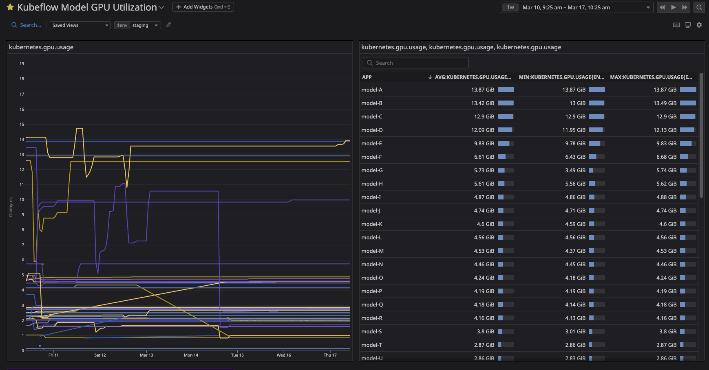

# 🐕 gpu-watchdog
Monitor Nvidia GPU utilization and ship metrics to Datadog.

## installation
0. Import [the dashboard](./docs/model-gpu-utilization.json) into Datadog
1. Update your `DD_API_KEY` in [deploy.yaml](./deploy.yaml#L92)
2. `kubectl apply -f deploy.yaml`

Alternative install method (Helm Chart) coming soon!

## usage
`python3 gpu_watchdog.py` 
or 
`docker run -it gpu-watchdog:latest`

Note that this application requires 
* access to the host's PID space (set via [the `hostPID` flag](./deploy.yaml#L65))
* [permission to list pods in all namespaces](./deploy.yaml#L8-L10)

## configuration
The following configuration options are available as env vars:
* `LOG_LEVEL`: change the logging verbosity; defaults to `INFO`
* `DD_SITE`: Datadog site to use for metrics submission; defaults to `datadoghq.com`, but can be set to `datadoghq.eu`
* `DD_API_KEY`: API Key for Datadog
* `SECONDS_BETWEEN_SAMPLES`: how often to query `nvidia-smi`; defaults to `"5"`

## how it works
We query `nvidia-smi --query-compute-apps=pid,used_memory --format=csv`, and use the returned PIDs to extract the container ID from the host's `/proc/<PID>/cgroup` file(s). (inspired by [pid2pod](https://github.com/heptiolabs/pid2pod#pid2pod))

> It works by looking up the target process's cgroup metadata in /proc/$PID/cgroup. This metadata contains the names of each cgroup assigned to the process. In the case of Docker containers created using the docker CLI or created by the kubelet, these cgroup names contain the Docker container ID. We can map this container ID to a Kubernetes pod by doing a lookup against the local kubelet API.

TODO: Update links
We [enrich the `used_memory` stat with metadata from the associated Pod](./gpu_watchdog.py#L79-L111), and [publish to Datadog as `kubernetes.gpu.usage`](./gpu_watchdog.py##L44-61).

